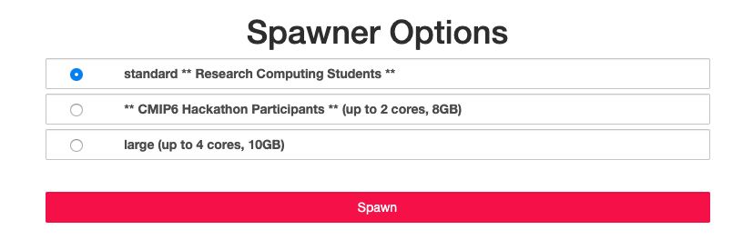

### *2019.11.13* -  Quick Preview of CMIP6 GCS (Google Cloud Store) access methods 
- Session 3 Wednesday, November 13, 1:30-2:00 PM (location: Ocean 105 or 104)

### *2019.11.07* -  Quick Preview of CMIP6 GCS (Google Cloud Store) access methods 
- Session 2 Thursday, November 7, 10-10:30 AM (location: Ocean 105 or 104)

### *2019.11.06* -  Quick Preview of CMIP6 GCS (Google Cloud Store) access methods 
- Session 1 Wednesday, November 6, 10-10:30 AM (location: Ocean 105 or 104)

### *2019.11.01* -  Pangeo CMIP6 Google Cloud Repository (`zarr` format)

- Go to the [Pangeo Jupyter Hub](https://ocean.pangeo.io) and "Sign in with GLOBUS"

Once you click on this button, you can either log in with your Columbia UNI (this is easiest) but you can also sign in with your [ORCID](https://orcid.org/register), see the lower right hand side of the screen.

- Now you will need to choose one of the sizes (doesn't really matter which)


- This is JupyterHub - there is only one kernel - `Python 3`, but you can `conda/pip install` other packages. The tutorials do not require any other packages.

- Next you can download some short tutorials, using either the notebook (put ! at the beginning of the line) or a terminal:

``` 
wget http://haden.ldeo.columbia.edu/notebooks/tutorial-Intake.ipynb
wget http://haden.ldeo.columbia.edu/notebooks/tutorial-noIntake.ipynb
```

- Start working through either tutorial.

- When you are finished, go to >File >Hub Control Panel >Stop My Server >Logout (upper righthand corner)

### *2019.10.18* - Hackathon Pages

 - [Hackathon Projects](https://discourse.pangeo.io/c/cmip6hack/cmip6hack-projects)
 - [Pangeo Gitter](https://gitter.im/pangeo-data/data)
 - [Hackathon Agenda](https://cmip6hack.github.io/#/schedule)
 - [NCAR CMIP6 Hackathon](https://cmip6hack.github.io/#/)

### *2019.09.28* - CMIP6 Cloud Data Request for Hackathon

- [Make Request Here](https://docs.google.com/forms/d/e/1FAIpQLScFjA5IddqBs2Rc0xGbzn32NPq12TKr-b-8KGtXWyNDK5sJCg/viewform)

### *2019.09.01* -  OCP CMIP6 Repository (`netcdf` format)

- Haibo Liu continues to collect CMIP6 data for our OCP projects on the machines mary (for 'Amon') and june (for '6hrLev' and '3hr')
- Whatever he collects, the division is free to use on the guest Jupyter notebook on mary (https://mary.ldeo.columbia.edu:8000). Login as guest and then ask Haibo for the password if you have forgotten it. Those working with Haibo directly will have their own accounts on mary and june.
- We continue to develop more catalog/data access methods - `ingrid` and `python` are both supported and the hyrax `opendap` server allows us to pull the netcdf files into `matlab`, etc.  
- The mary and june homepages give many hints on how to access the data. Send a quick email to Haibo or me if you need the URL of their homepages.

