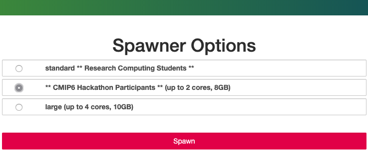

### Quick tutorial for using the Pangeo CMIP6 Repo directly on JupyterHub running in Google Cloud

- Step 1. Go to the [Pangeo Jupyter Hub](https://ocean.pangeo.io) and "Sign in with GLOBUS"

Once you click on this button, you can either log in with your Columbia UNI (this is easiest) but you can also sign in with your [ORCID](https://orcid.org/register), see the lower right hand side of the screen.

-------------
- Step 2. Now you will need to choose one of the sizes (doesn't really matter which)


-------------
- Step 3. This is JupyterHub - there is only one kernel - `Python 3`, but you can `conda/pip install` other packages. The tutorials do not require any other packages.

-------------
- Step 4. Next you can download some short tutorials, using either the notebook (put ! at the beginning of the line) or a terminal:

```
wget http://haden.ldeo.columbia.edu/notebooks/tutorial-Intake.ipynb
wget http://haden.ldeo.columbia.edu/notebooks/tutorial-noIntake.ipynb
```
-------------
- Step 5. Start working through either tutorial.

-------------
- Step 6. **IMPORTANT:** When you are finished, go to >File >Hub Control Panel >Stop My Server >Logout (upper righthand corner)


